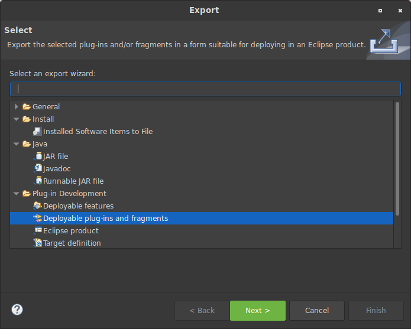
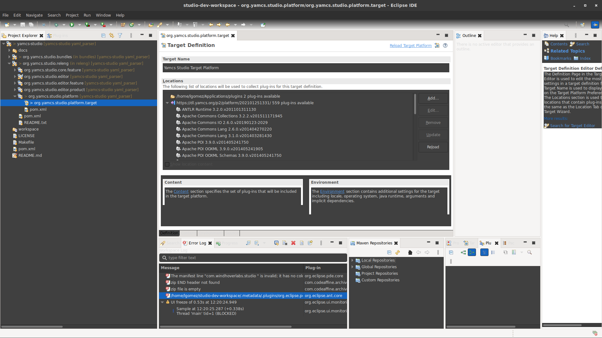
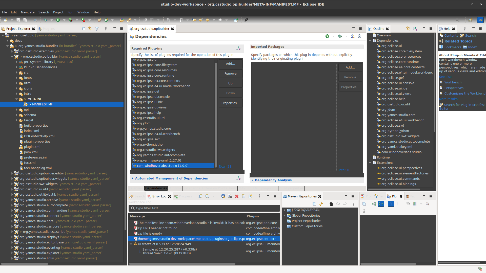

Eclipse plugin to load CFS configuration to YAMCS Studio.

## How to load the plugin with Studio at Startup

Dependencies:
- `snakeYAML`

Assumptions:
- YAMCS Studio is installed in `/opt/yamcs-studio`.
- Eclipse for RCP developers 2020-12 (4.18.0) is installed
- The [orbit](https://download.eclipse.org/tools/orbit/downloads/) repository is added to your Eclipse installation

1. Package the plugin as a `jar` file from Eclipse:
    - Right click on the `ConfigurationRegistry` Project and export as _Deployable plugins and fragments_
    - Click next
      
    - Set a Directory destination
    - Click Finish
    
    
  This will export a jar file to a `plugins` directory called(assuming no configuration has been changed) `com.windhoverlabs.studio_1.0.0.jar`  

2. Now open up YAMCS Studio in Eclipse following these [instructions](https://github.com/WindhoverLabs/yamcs-studio/tree/yaml_parser).

**NOTE** Just like the YAMCS instructions state, the headless maven build _must_ work as it generates artifacts used by Eclipse. So do not skip any of those steps.

3. Add the location directory of the jar generated in Step1 to org.yamcs.studio.platform.target from Eclipse:
   
   - Select Directory  
   - Give it the location of the jar file. It should be something like `some_path/plugins`

4. Add the ConfigurationRegistry plugin to `bundles/org.csstudio.opibuilder/META-INF/MANIFEST.MF b/bundles/org.csstudio.opibuilder/META-INF/MANIFEST.MF`:
   - Click Add
   - Type `com.windhoverlabs.studio` in the text box
   - Click Add(Should be a green button)
   

Make sure you save those files and close Eclipse.

5. Package Studio from the shell:

```
cd [PATH_TO_YAMCS_STUDIO]
export JAVA_HOME=/usr/lib/jvm/java-11-openjdk-amd64/
mvn clean package -DskipTests
cd releng/org.yamcs.studio.editor.product/target/products/
mkdir  /opt/yamcs-studio
tar -xzf yamcs-studio-1.5.5-SNAPSHOT-linux.gtk.x86_64.tar.gz --strip-components=1 -C "/opt/yamcs-studio/"
```

The next time you open up Studio, you should have the ConfigurationRegistry plugin available for use and you should also be able to access its API
from OPI scripts.

Documentation updated  on March 9, 2021